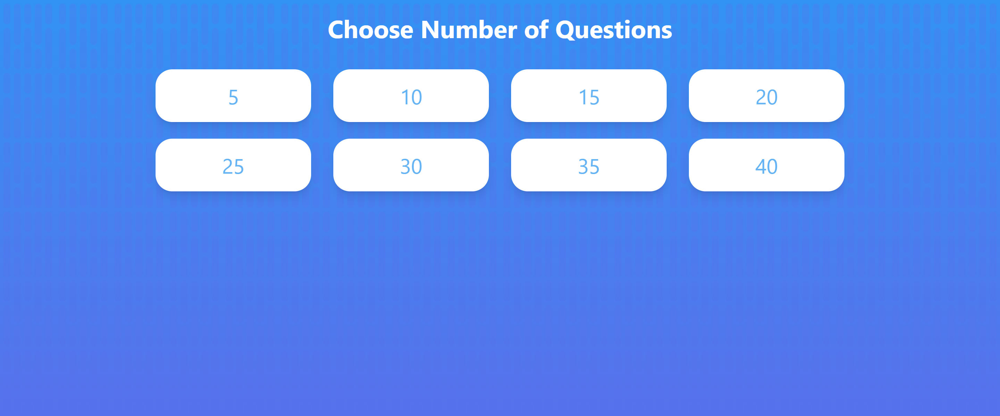
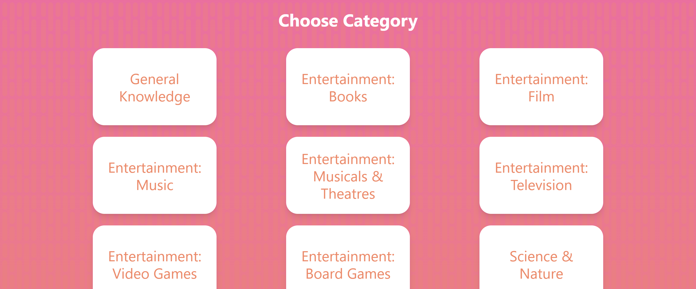
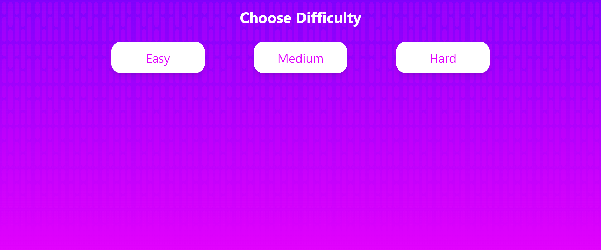
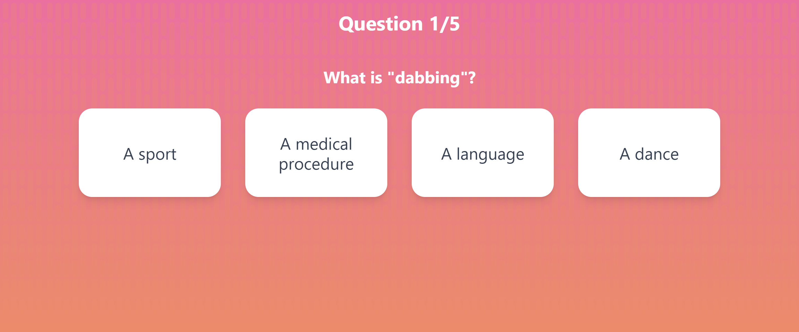
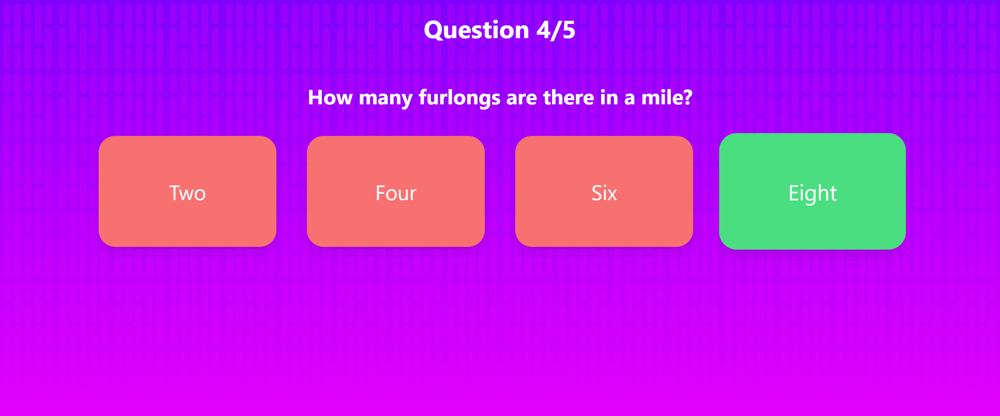
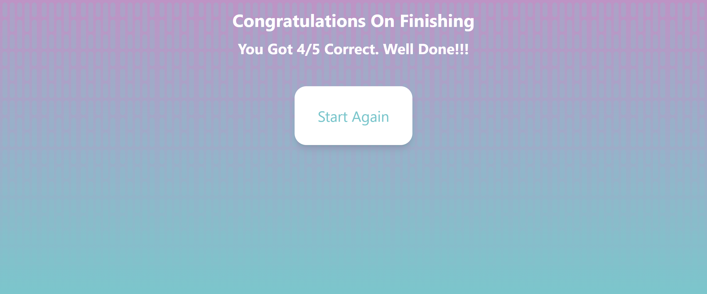

# Xstate Trivia Game

Simple web app trivia game built using react and xstate. Players select the number of questions, the category and the difficulty, to generate multiple choice questions. Goal of this game was to explore the features of [XState](https://xstate.js.org/docs/).

## Production URL

<a href="https://trivia-app-clevins.vercel.app/" target="_blank">Trivia Game</a>

## Project Screen Shots and Designs

#### Designs:   

<a href="https://www.figma.com/file/6h9JUJuP35tEwo78FsPBQq/Trivia-Game" target="_blank">Figma File</a>

#### Screenshots:
Select Question:

Select Category:

Select Difficulty:

Question:

Answer:

End Quiz:

## Installation and Setup Instructions

Clone down this repository. You will need `node` and `npm` installed globally on your machine.  

Installation:

`npm install`  

To Run Test Suite:  

`npm test`  

To Start Dev Server:

`npm run dev`  

To Visit App:

`localhost:3000`  

To Create Build:

`npm run build`  

To Preview Build:

`npm run preview`  

To Build and Preview:

`npm run preview-build`  

## Technologies Used

Icon | Technoogy Name | URL 
:-----:|  :-----: | -----
 | TypeScript | `https://www.typescriptlang.org/docs/`
 | XState | `https://xstate.js.org/`
 | React | `https://beta.reactjs.org/`
 | Vite | `https://vitejs.dev/`
| HTML5 | `https://www.w3schools.com/html/default.asp`
| CSS3 | `https://www.w3schools.com/css/default.asp`
| Figma | `https://www.figma.com/`
 | Tailwind | `https://tailwindcss.com/`
 | VSCode | `https://code.visualstudio.com/`
